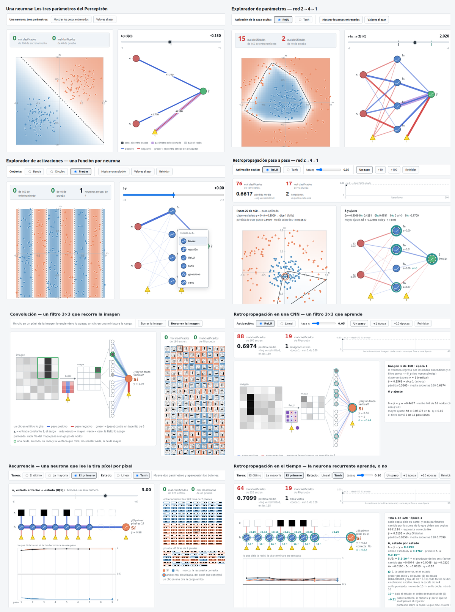

# BasicRNA

Once páginas HTML para las primeras clases de redes neuronales: una idea por página.

*La portada retrata las cuatro primeras páginas.*

Cada página es un solo archivo HTML: se abre con doble clic, sin instalar nada y sin
conexión. No hay bibliotecas, CDN ni compilación; el dibujo es canvas 2D y la aritmética
es la nativa de JavaScript. Las once comprueban sus cuentas antes de dibujar: si una
comprobación falla, la página no crea ningún lienzo y dice por qué.

Para recorrerlas, abre `index.html`, el portal con una miniatura por página. El orden
importa: cada una deja una pregunta que contesta la siguiente.

## Las once páginas, en orden

1. **`1-Perceptron.html` — Una neurona: los tres parámetros del perceptrón.** Cada parámetro hace algo que se puede decir en una frase: los dos pesos giran la recta, el sesgo la desplaza.
2. **`2-EditParam.html` — Explorador de parámetros, red 2→4→1.** Diecisiete parámetros sobre dos clases que ninguna recta separa, y mover un peso cambia el mapa de un modo que nadie puede anticipar.
3. **`3-EditActivFun.html` — Explorador de activaciones, una función por neurona.** Las cuatro neuronas ocultas pueden llevar funciones distintas: lo que se elige ya no es un número sino una forma.
4. **`4-Backprop.html` — Retropropagación paso a paso, red 2→4→1.** La primera que entrena: aquí no se mueve ningún parámetro a mano, se ve cómo los mueve el algoritmo, de un punto a la vez.
5. **`5-Convolucion.html` — Convolución: un filtro 3×3 que recorre la imagen.** El mismo filtro en todas partes y cada celda del mapa mirando una zona; la red ya viene entrenada y lo que el alumno cambia es la entrada.
6. **`6-BackpropCNN.html` — Retropropagación en una CNN: un filtro 3×3 que aprende.** La quinta usa la red ya entrenada y ésta la entrena: el filtro es uno solo, así que su cambio es la suma de lo que pide cada posición.

La serie recurrente, de la 7 a la 11:

7. **`7-NeuronaEnElTiempo.html` — Una neurona en el tiempo: recuerda u olvida.** Arriba la red dibujada una vez y abajo el registro de lo que hizo: los círculos de una fila son la misma neurona en momentos distintos.
8. **`8-Recurrente.html` — Recurrencia: una neurona que lee la tira píxel por píxel.** La red recurrente más chica tiene cinco parámetros, así que vuelven a moverse a mano, y el mismo parámetro se usa en cada paso.
9. **`9-BackpropTiempo.html` — Retropropagación en el tiempo: la neurona recurrente aprende, o no.** La solución existe y el descenso por gradiente no la encuentra: poder representar no es poder aprender.
10. **`10-VariasNeuronas.html` — Varias neuronas recurrentes: la paridad y el residuo entre tres.** La memoria deja de ser un número y pasa a ser un vector: dos o tres neuronas de estado.
11. **`11-LazoComoMatriz.html` — El lazo como matriz: la señal de gradiente con dos neuronas.** Con dos neuronas el factor de regreso ya no es un número sino una matriz: la red avanza con U y la señal regresa con U traspuesta.

`Explica.md` documenta el desarrollo de las páginas: las arquitecturas, los datos y las cifras medidas.
`doc/` guarda el apoyo didáctico: documentos teóricos con los vectores y las matrices escritos como arreglos; hoy tiene `doc/LazoComoMatriz.md`, la teoría de la página 11.
`CLAUDE.md`, `DECISIONES.md`, `TODO.md` y los `ESPEC-*.md` son del proceso de trabajo.

## Autoría y licencia

Miguel Ángel Norzagaray Cosío, Departamento Académico de Sistemas Computacionales, UABCS. MIT — ver `LICENSE`.
